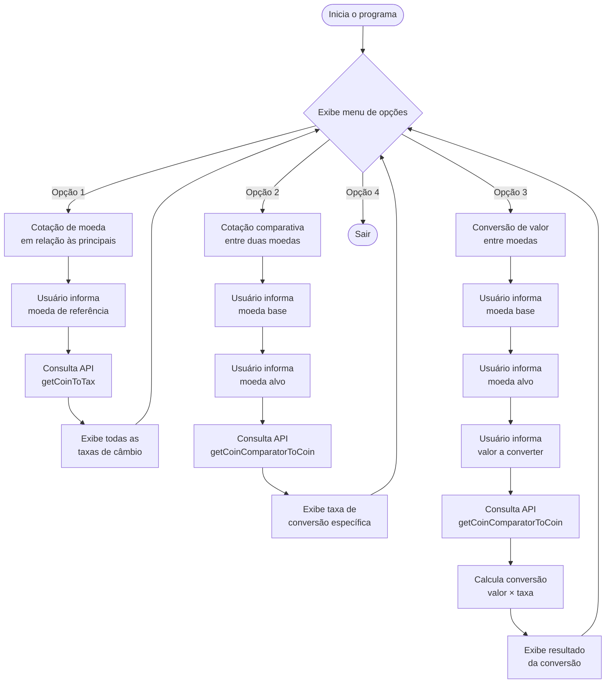
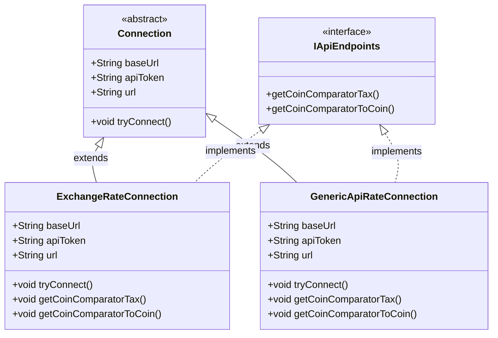

<div align="center">

# 💱 Coin Converter CLI

[](https://www.oracle.com/java/)
[](https://maven.apache.org/wrapper/)
[](LICENSE)

**Conversor de moedas interativo para terminal**

Desenvolvido em Java 21 para o desafio **Oracle Next Education** em parceria com a **Alura**.

</div>

---

## 📋 Sobre o Projeto

O **Coin Converter CLI** é uma aplicação de linha de comando que permite converter valores entre diferentes moedas em tempo real. O programa consulta taxas de câmbio atualizadas através de uma API externa e apresenta os resultados de forma clara e interativa no terminal.

### ✨ Funcionalidades

- ✅ **Cotação atual**: Veja a cotação de uma moeda em relação às principais moedas do mundo
- ✅ **Cotação comparativa**: Compare a taxa de câmbio entre duas moedas específicas
- ✅ **Conversão de valores**: Converta um valor específico de uma moeda para outra
- ✅ Menu interativo e navegável com 4 opções
- ✅ Taxas de câmbio em tempo real via ExchangeRate API
- ✅ Tratamento robusto de erros e exceções
- ✅ Interface CLI amigável e responsiva
- ✅ Suporte a múltiplas moedas (BRL, USD, EUR, GBP, JPY, etc.)

---

## 🛠️ Tecnologias Utilizadas

- **Java 21** — Linguagem de programação
- **Maven Wrapper** — Gerenciamento de build (sem necessidade de instalação global)
- **Gson** — Biblioteca para parsing JSON
- **ExchangeRate API** — Fonte de dados de taxas de câmbio em tempo real
- **Git** — Controle de versão

---

## 📊 Arquitetura do Projeto

### Fluxo de Execução



### Diagrama de Classes

O projeto utiliza uma arquitetura orientada a objetos com separação clara de responsabilidades:

- **Classe abstrata `Connection`**: Define a estrutura base para conexões com APIs, gerenciando URLs, tokens e métodos de conexão.
- **Interface `IApiEndpoints`**: Contrato que define os métodos necessários para obter taxas de câmbio.
- **Implementações concretas**: Classes como `ExchangeRateConnection` implementam a lógica específica de cada provedor de API.



**Responsabilidades das classes**:

- **`Connection`**: Gerencia a conexão HTTP, montagem de URLs, autenticação e tratamento de erros
- **`IApiEndpoints`**: Define contratos para obtenção de taxas de câmbio
- **Classes concretas**: Implementam a lógica específica de parsing JSON e extração de dados relevantes

---

## 🚀 Como Rodar

### Pré-requisitos

Antes de começar, certifique-se de ter instalado:

- [Java 21](https://www.oracle.com/java/technologies/downloads/#java21) ou superior
- [Git](https://git-scm.com/downloads)
- Um token de API válido do [ExchangeRate-API](https://www.exchangerate-api.com/)

> ℹ️ **Nota**: Não é necessário instalar Maven — o projeto já inclui o **Maven Wrapper** (`mvnw`), que gerencia automaticamente a versão correta do Maven.

### Instalação e Execução

**1. Clone o repositório**

```powershell
git clone https://github.com/filoroch/coin-converter-cli.git
cd coin-converter-cli
```

**2. Configure o token da API**

Obtenha gratuitamente seu token em [ExchangeRate-API](https://www.exchangerate-api.com/) e configure como variável de ambiente:

**No Windows (PowerShell):**

```powershell
# Defina a variável de ambiente (permanente)
setx API_TOKEN "seu_token_aqui"

# Ou defina para a sessão atual sem reiniciar o terminal
$env:API_TOKEN = "seu_token_aqui"
```

> ⚠️ **Importante**: Após usar `setx`, abra um **novo terminal** para que a variável fique disponível.

**No Linux/macOS:**

```bash
# Adicione ao seu ~/.bashrc ou ~/.zshrc para tornar permanente
export API_TOKEN="seu_token_aqui"

# Ou defina apenas para a sessão atual
export API_TOKEN="seu_token_aqui"
```

**3. Compile e execute**

```powershell
# Compile o projeto usando Maven Wrapper
.\mvnw.cmd clean package

# Execute a aplicação
java -cp target/classes com.alura.Main
```

> 💡 **Dica**: O Maven Wrapper (`mvnw`) está incluído no projeto e garante que todos usem a mesma versão do Maven, sem precisar instalá-lo globalmente.

**No Linux/macOS:**

```bash
# Compile o projeto
./mvnw clean package

# Execute a aplicação
java -cp target/classes com.alura.Main
```

**Alternativa**: Abra o projeto em sua IDE favorita (IntelliJ IDEA, Eclipse, VS Code) configurada para Java 21 e execute a classe `Main.java`.

---

## 💡 Exemplo de Uso

```
[Coin-converter-cli]
An util tool from converter coin to coin

[tools]
1. Cotação atual de uma moeda em relação as principais moedas
2. Cotação de uma moeda em relação a outra
3. Conversão de um valor de uma moeda a outra
4. Sair

Opção: 3

Digite a moeda referencia base Ex:
-BRL - Real brasileiro
-USD - Dolar estadunidense
USD

Digite a moeda referencia da qual você deseja obter a cotação em relação a USD Ex:
-BRL - Real brasileiro
-USD - Dolar estadunidense
BRL

Digite o valor em USD que sera convertido para BRL
100

Cotação do valor 100.0 em USD para BRL

495.50

[Coin-converter-cli]
An util tool from converter coin to coin

[tools]
1. Cotação atual de uma moeda em relação as principais moedas
2. Cotação de uma moeda em relação a outra
3. Conversão de um valor de uma moeda a outra
4. Sair

Opção: 4
Encerrando a aplicação
```

---

## 🔮 Ideias Futuras

- [ ] Adicionar suporte para mais moedas (EUR, GBP, JPY, etc.)
- [ ] Implementar histórico de conversões
- [ ] Criar interface gráfica (GUI) com JavaFX
- [ ] Adicionar modo offline com cache de taxas
- [ ] Gerar relatórios em PDF
- [ ] Suporte a múltiplas APIs de câmbio (arquitetura plugável)
- [ ] Testes unitários com JUnit 5
- [ ] Containerização com Docker

---

## 📝 Licença

Este projeto foi desenvolvido para fins educacionais como parte do desafio **Oracle Next Education (ONE)** em parceria com a **Alura**.

---

## 👤 Autor

**Filipe Rocha** ([@filoroch](https://github.com/filoroch))

Projeto criado como parte do programa **Oracle Next Education** 🎓

---

<div align="center">

⭐ Se este projeto foi útil para você, considere dar uma estrela!

</div>
