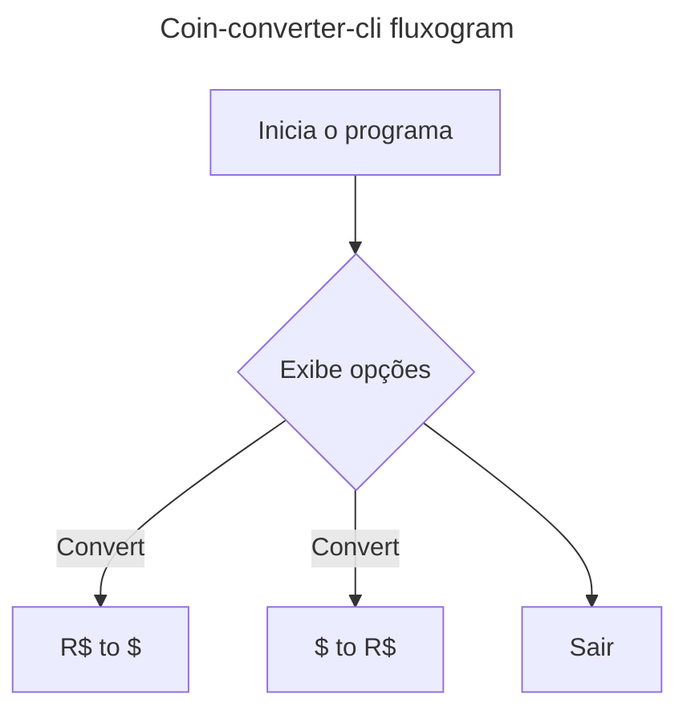

<h1 align=center> Coin-converter-cli</h1>
Conversor de moedas desenvolvido em Java 21 para o desafio da Oracle Next Education em parceria com a Alura

## Sobre o projeto
O projeto consiste em um conversor de moedas que roda no terminal (cli/linha de comando), que exibe um menu de opções e permite converter moedas

### Fluxo
- Inicio
- Exibe menu de opções iterativo
    1. Converter \$ para R$
    2. Converter R$ para $
    3. Sair
- Usuario insere opção de conversão de moeda
- Conversão e feita
- renderização no cli
- Fim
### Esquema de classes
- **classe de conexão** -> responsavel por criar o request, passar os parametros, fazer a requisição, lidar com erros e retornar o response
    ```mermaid
    classDiagram
    direction TB
    
    Connection <|-- "extends" ExchangeRateConnection
    Connection <|-- "extends" GenericApiRateConnection
    IApiEndpoints <.. "implements" ExchangeRateConnection
    IApiEndpoints <.. "implements" GenericApiRateConnection

    class Connection{
        <<abstract>>
        +String baseUrl
        +String apiToken
        +String url = baseUrl + apiToken
        +void tryConnect()
    }

    class IApiEndpoints{
        +getCoinComparatorTax()
        +getCoinComparatorToCoin()
    }

    class ExchangeRateConnection{
        +String baseUrl
        +String apiToken
        +String url = baseUrl + apiToken
        +void tryConnect() forma de conectar usando ExchangeRate
        +void getCoinComparatorTax() 
        +void getCoinComparatorToCoin()
    }

    class GenericApiRateConnection{

    }
    ```

- classe de tratamento/parsing -> responsavel por tratar a saida recebida para o padrão legivel JSON , alem de fornecer somente os dados esperados


## Como rodar
1. Clone o projeto
    
    ```bash
    git clone https://github.com/filoroch/coin-converter-cli
    ```
    
2. Defina as variáveis de ambiente
    - No windows, execute os codigos abaixo passando o token da api e reinicie o shell
        
        ```json
        setx API_TOKEN "api_token"
        [Environment]::SetEnvironmentVariable("API_TOKEN", "api_token", "User")
        
        ```
        
    - No linux/mac
        
        ```json
        export API_TOKEN="api_token"
        ```
        
## Ideias futuras
- [ ] Implementar interface de conexão para que a api usada seja passada concretamente na classe de conexão
## Creditos
