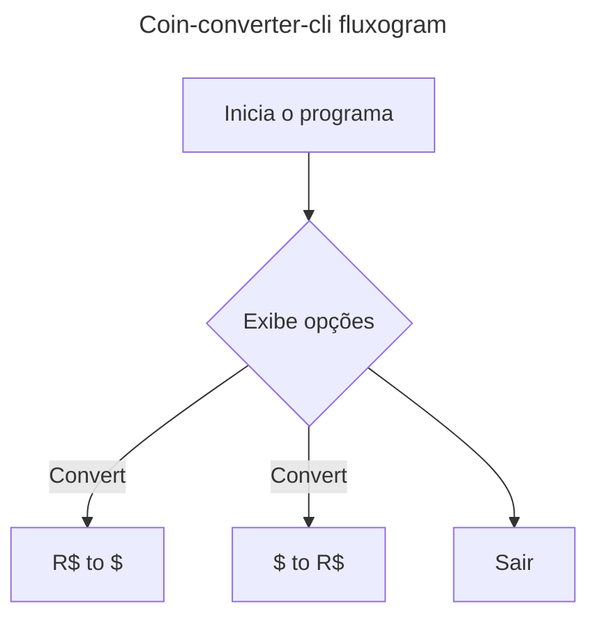

<h1 align=center> Coin-converter-cli</h1>
Conversor de moedas desenvolvido em Java 21 para o desafio da Oracle Next Education em parceria com a Alura

## Sobre o projeto
O projeto consiste em um conversor de moedas que roda no terminal (cli/linha de comando), que exibe um menu de opções e permite converter moedas

### Fluxo
- Inicio
- Exibe menu de opções iterativo
    1. Converter \$ para R$
    2. Converter R$ para $
    3. Sair
- Usuario insere opção de conversão de moeda
- Conversão e feita
- renderização no cli
- Fim
### Esquema de classes
- **classe de conexão** -> responsavel por criar o request, passar os parametros, fazer a requisição, lidar com erros e retornar o response
    ```mermaid
    classDiagram
    direction TB
    
    namespace Connection {
        class IConnectApi{
            <<interface>>
            +getComparatorCoinEndpoint(baseCoin: string, targetCoin: string) string
            +getCoinRelation() string
        }
        
        class ConnectionApi {
            -baseURL: string
            -apiToken: string
            -url: string
            +tryConnect() boolean
            +getComparatorCoinEndpoint(baseCoin: string, targetCoin: string) string
            +getCoinRelation() string
        }
        
        class ExchangeRateConnectApi {
            +getComparatorCoinEndpoint(baseCoin: string, targetCoin: string) string
            +getCoinRelation() string
        }

        class GenericConnectApi{
            +getComparatorCoinEndpoint(baseCoin: string, targetCoin: string) string
            +getCoinRelation() string
        }
    }
    
    IConnectApi <|.. ConnectionApi : implements
    ConnectionApi <|-- ExchangeRateConnectApi : extends
    ConnectionApi <|-- GenericConnectApi : extends
    
    note for ConnectionApi "Configura os métodos básicos para conectar em uma API de conversão de taxas"

    ```

- classe de tratamento/parsing -> responsavel por tratar a saida recebida para o padrão legivel JSON , alem de fornecer somente os dados esperados


## Como rodar
## Ideias futuras
- [ ] Implementar interface de conexão para que a api usada seja passada concretamente na classe de conexão
## Creditos
