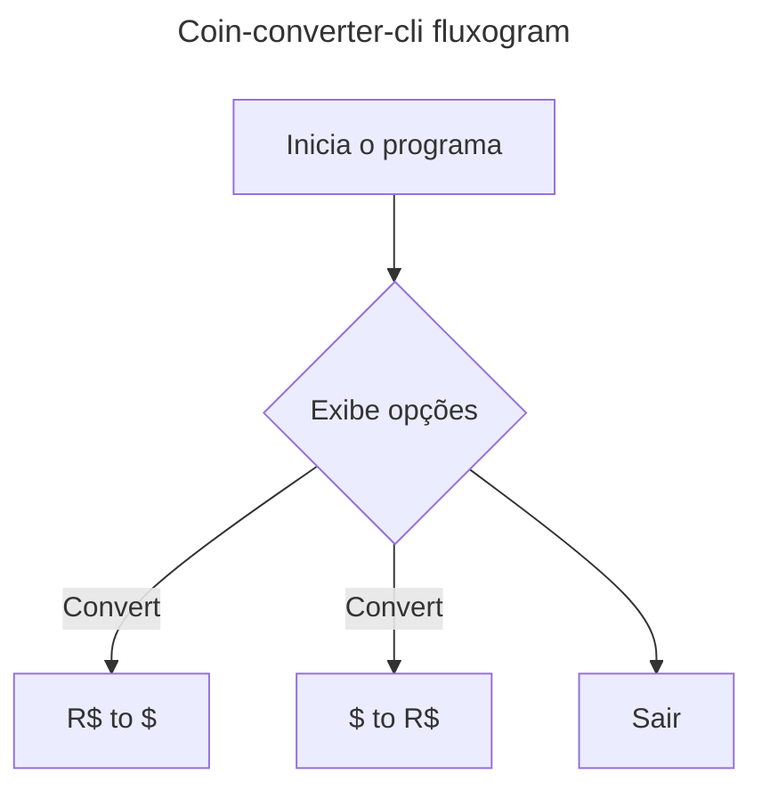

<h1 align=center> Coin-converter-cli</h1>
Conversor de moedas desenvolvido em Java 21 para o desafio da Oracle Next Education em parceria com a Alura

## Sobre o projeto
O projeto consiste em um conversor de moedas que roda no terminal (cli/linha de comando), que exibe um menu de opções e permite converter moedas

### Fluxo
- Inicio
- Exibe menu de opções iterativo
    1. Converter \$ para R$
    2. Converter R$ para $
    3. Sair
- Usuario insere opção de conversão de moeda
- Conversão e feita
- renderização no cli
- Fim

## Como rodar
## Creditos